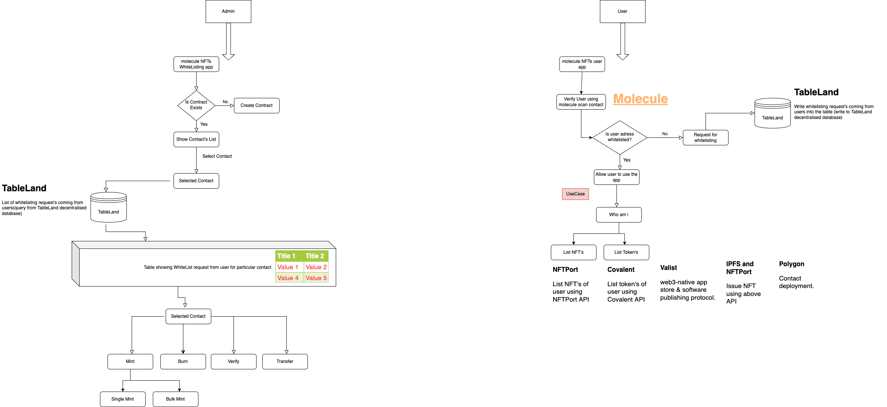

## Molecule NFT whitelisting(NFT-Gating).

Molecule App(Admin app) https://github.com/Mohammed-Abrar-Neeman/molecule-nft-whitelisting.git

Titans App(Client app) https://github.com/Mohammed-Abrar-Neeman/molecule-nft-whitelisting-client.git

1. User can create their own Whitelisting NFT(ERC721 contract) from Molecule Factory , which can be used in their application for access control.
   Minting NFT’s to the whitelisted users

2. Molecule protocol consist of 2 smart contracts ,
   . molecule factory contracts which has all the molecule protocol features and
   . molecule scan contract which act as a middle ware contract between molecule factory and the user contract.

3. The protocol can be used either by directly creating an instance of factory contract in the application UI layer and calling the query functions or can be used by importing the molecule scan contract into the user smart contract in the solidity level

4. At present Molecule Protocol has NFT whitelisting , Sanction list features, later we include documents signing, kyc, credit3 etc

5. All the functionality for the Molecule protocol is fully on chain

## How its made

### Polygon

The molecule protocol deploy the user created ERC-721 contract to polygon.

### IPFS

Uploads images through IPFS, and configures metadata. And, this metadata URI and contract address are connected at the front end(next.js).

### TableLand

When a user enroll for subscription(nothing but NFT whitelisting), all data is stored in the on-chain through the tableland.
The admin page(molecule app) retrieves data from tableland, and based on this data, the administrator selects a specific address and mint the NFT for the requested user. Tableland made it easy to implement all these processes.

### NFTPort

This project uses NFT-port API to fetch the NFT holdings of provide/connected address.

### Covalent

We used covalent API to fetch the address's ERC20 token holdings.

### Valist

We published out project in valist.https://app.valist.io/mohammed-abrar-neeman/molecule-whitelist-admin

For more details visit Docs : https://docs.moleculeprotocol.io/developers
